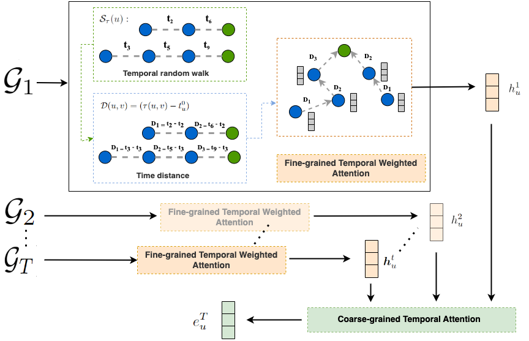

# TE-DyGE: Temporal Evolution-enhanced Dynamic Graph Embedding Network
## Framework



## Implementation

https://github.com/liane886/TE-DyGE

## Setup
```
conda env create -f TE_DyGE.yml
```
## Example Usage
To reproduce the experiments on EComm dataset, simply run:
```
python run_script.py
```
## Dataset 
Statistics of dataset:


## Results
Results for each snapshpot can be found in the 'logs' file.

## Acknowledgement
The original version of this code base was originally forked from [DySAT] https://github.com/aravindsankar28/DySAT 
```
@inproceedings{Xue2020DyHATR,
  title     = {Modeling Dynamic Heterogeneous Network forLink Prediction using Hierarchical Attentionwith Temporal RNN},
  author    = {Xue, Hansheng and Yang, Luwei and Jiang, Wen and Wei, Yi and Hu, Yi and Lin, Yu},
  booktitle = {Proceedings of the 2020 European Conference on Machine Learning and Principles and Practice of Knowledge Discovery in Databases (ECML-PKDD)},
  year      = {2020},
}
```
