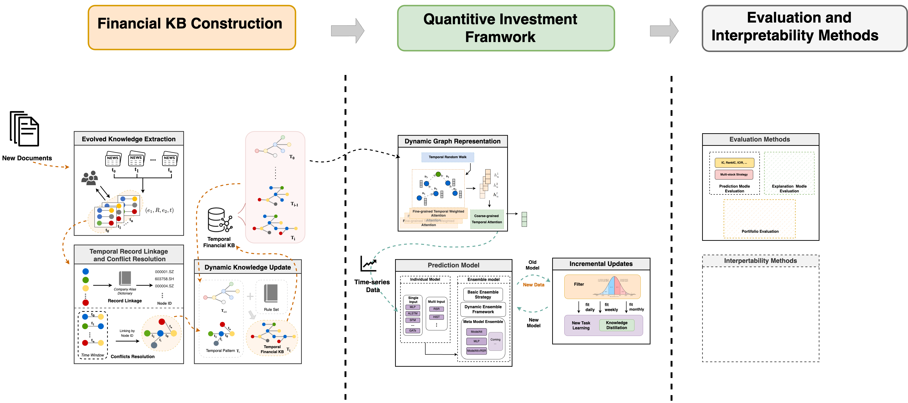

# K-Quant: A Platform of Temporal Financial Knowledge-enhanced Quantitative Investment

[(https://arxiv.org/abs/2308.04947)]

## Overview
In recent years, domain-specific knowledge bases (KBs) have attracted more attention in academics and industry because of their expertise and in-depth representation in a specific domain. However, when constructing a domain-specific KB, one needs to address not only the challenges in constructing a general KB, but also the difficulties raised by the nature of domain-specific raw data. Considering the usability of financial Knowledge Bases (KBs) in many downstream applications, such as financial risk analysis and fraud detection, we propose a Platform for Temporal Financial KB Construction, K-Quant Platform. 

If you find this system helpful in your research, please consider citing our papers that are listed below:

[1] **T-FinKB: A Platform of Temporal Financial Knowledge Base Construction.**
*Xinyi Zhu, Liping Wang, Hao Xin, Xiaohan Wang, Zhifeng Jia, Jiyao Wang, Chunming Ma, Yuxiang Zeng.* ICDE 2023. \[[paper](https://ieeexplore.ieee.org/document/10184672)\]

[2] **Methods for Acquiring and Incorporating Knowledge into Stock Price Prediction: A Survey.**
*Liping Wang, Jiawei Li, Lifan Zhao, Zhizhuo Kou, Xiaohan Wang, Xinyi Zhu, Hao Wang, Yanyan Shen, Lei Chen.* Arxiv 2023. \[[paper](https://arxiv.org/abs/2308.04947)\]

## Main Features

The main features of K-Quant:

1. Dynamic Financial KB Construction
2. Quantitive Investment Framework
3. Evaluation and Interpretability Methods

<!-- TOC -->

## Outline

- [Overview](#overview)
- [Main Features](#main-features)
- [Outline](#outline)
- [Quick Start](#quick-start)
  - [Prerequisites](#prerequisites)
  - [Installation](#installation)
  - [Usage](#usage)
- [Benchmark Dataset](#benchmark-dataset)
  - [Description](#description)
  - [Data Format](#data-format)
- [Related Work](#related-work)
- [Acknowledgement](#acknowledgement)

<!-- /TOC -->

## Quick Start

### Prerequisites

### Installation

### Usage

## Benchmark Dataset

### Description

### Data Format

## Published Papers

> Liping Wang, Yanyan Shen, and Lei Chen. 2023. TE-DyGE: Temporal Evolution-Enhanced Dynamic Graph Embedding Network. In Database Systems for Advanced Applications: 28th International Conference, DASFAA 2023, Tianjin, China, April 17–20, 2023, Proceedings, Part III. Springer-Verlag, Berlin, Heidelberg, 183–198. https://doi.org/10.1007/978-3-031-30675-4_13

> Xinyi Zhu, Hao Xin, Yanyan Shen, and Lei Chen. 
HIT - An Effective Approach to Build a Dynamic Financial Knowledge Base. In Database Systems for Advanced Applications: 28th International Confer- ence, DASFAA 2023, Tianjin, China, April 17–20, 2023, Proceedings, Part II, pages 716–731. Springer, 2023. https://link.springer.com/chapter/10.1007/978-3-031-30672-3_48

> Liping Wang, Jiawei Li, Lifan Zhao, Zhizhuo Kou, Xiaohan Wang, Xinyi Zhu, Hao Wang, Yanyan Shen, Lei Chen.
Methods for Acquiring and Incorporating Knowledge into Stock Price Prediction: A Survey. https://arxiv.org/abs/2308.04947

## Related Works

## Acknowledgement
